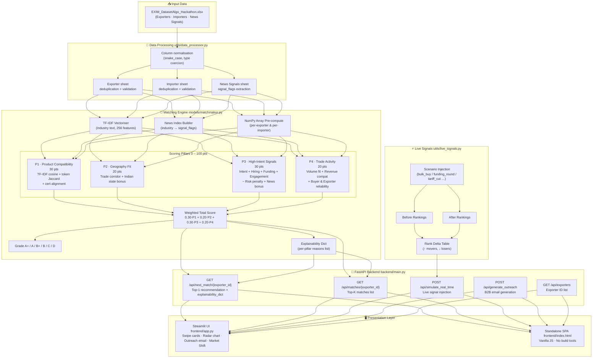
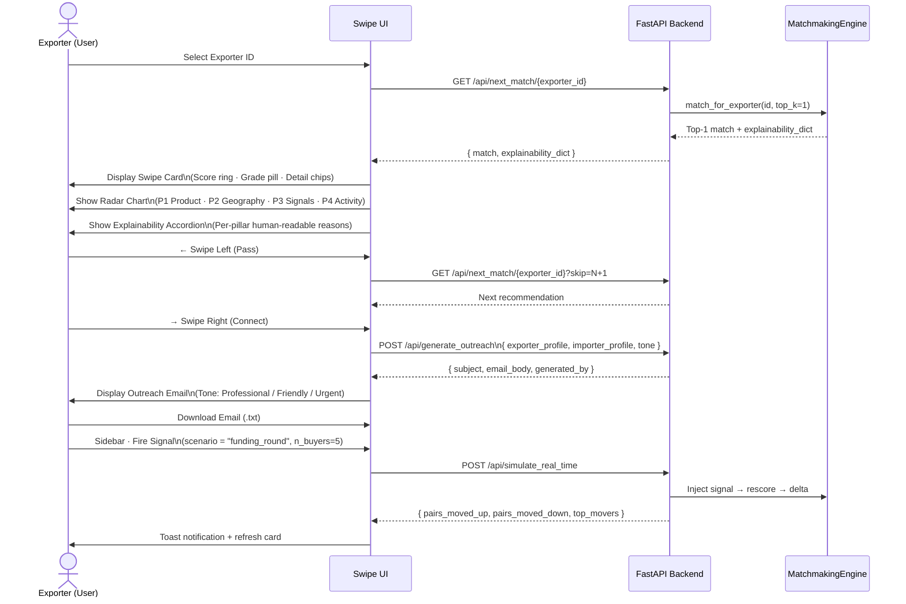
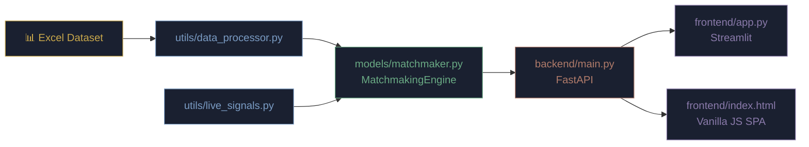

# TradeMatch LOC — Architecture Diagrams

> Mermaid.js diagrams for the hackathon submission.  
> Render at [mermaid.live](https://mermaid.live) or in any Mermaid-aware markdown viewer.

---

## 1 · Algorithm Architecture

How raw EXIM data flows through the pipeline and into the UI.

---

## 2 · User Workflow Map

The end-to-end journey from exporter selection to outreach dispatch.

---

## 3 · Component Map (Quick Reference)

