# TradeMatch LOC — Architecture Diagrams

> Mermaid.js diagrams for the hackathon submission.  
> Render at [mermaid.live](https://mermaid.live) or in any Mermaid-aware markdown viewer.

---

## 1 · Algorithm Architecture

How raw EXIM data flows through the pipeline and into the UI.

```mermaid
flowchart TD
    subgraph INPUT["📥 Input Data"]
        XL["EXIM_DatasetAlgo_Hackathon.xlsx\n(Exporters · Importers · News Signals)"]
    end

    subgraph PROC["🔧 Data Processing  utils/data_processor.py"]
        C1["Column normalisation\n(snake_case, type coercion)"]
        C2["Exporter sheet\ndeduplication + validation"]
        C3["Importer sheet\ndeduplication + validation"]
        C4["News Signals sheet\nsignal_flags extraction"]
        XL --> C1 --> C2 & C3 & C4
    end

    subgraph ENGINE["🧠 Matching Engine  models/matchmaker.py"]
        T["TF-IDF Vectoriser\n(Industry text, 256 features)"]
        N["News Index Builder\n(industry → signal_flags)"]
        A["NumPy Array Pre-compute\n(per-exporter & per-importer)"]

        subgraph PILLARS["Scoring Pillars  0 – 100 pts"]
            P1["P1 · Product Compatibility\n30 pts\nTF-IDF cosine + token Jaccard\n+ cert alignment"]
            P2["P2 · Geography Fit\n20 pts\nTrade corridor + Indian state bonus"]
            P3["P3 · High-Intent Signals\n30 pts\nIntent + Hiring + Funding + Engagement\n− Risk penalty + News bonus"]
            P4["P4 · Trade Activity\n20 pts\nVolume fit + Revenue compat\n+ Buyer & Exporter reliability"]
        end

        SCORE["Weighted Total Score\n0.30·P1 + 0.20·P2 + 0.30·P3 + 0.20·P4"]
        GRADE["Grade  A+ / A / B+ / B / C / D"]
        EXP["Explainability Dict\n(per-pillar reasons list)"]

        C2 & C3 & C4 --> T & N & A
        T & N & A --> P1 & P2 & P3 & P4
        P1 & P2 & P3 & P4 --> SCORE --> GRADE & EXP
    end

    subgraph SIGNAL["⚡ Live Signals  utils/live_signals.py"]
        SC["Scenario Injection\n(bulk_buy / funding_round / tariff_cut …)"]
        BEFORE["Before Rankings"]
        AFTER["After Rankings"]
        DELTA["Rank Delta Table\n(↑ movers, ↓ losers)"]
        SC --> BEFORE & AFTER --> DELTA
    end

    subgraph API["🚀 FastAPI Backend  backend/main.py"]
        EP1["GET /api/next_match/{exporter_id}\nTop-1 recommendation + explainability_dict"]
        EP2["GET /api/matches/{exporter_id}\nTop-K matches list"]
        EP3["POST /api/simulate_real_time\nLive signal injection"]
        EP4["POST /api/generate_outreach\nB2B email generation"]
        EP5["GET /api/exporters\nExporter ID list"]
    end

    subgraph UI["🖥 Presentation Layer"]
        ST["Streamlit UI  frontend/app.py\nSwipe cards · Radar chart ·\nOutreach email · Market Shift"]
        HTML["Standalone SPA  frontend/index.html\nVanilla JS · No build tools"]
    end

    SCORE & EXP --> EP1 & EP2
    DELTA --> EP3
    EP1 & EP2 & EP3 & EP4 & EP5 --> ST & HTML
```

---

## 2 · User Workflow Map

The end-to-end journey from exporter selection to outreach dispatch.

```mermaid
sequenceDiagram
    actor U as Exporter (User)
    participant UI as Swipe UI
    participant API as FastAPI Backend
    participant ENG as MatchmakingEngine

    U->>UI: Select Exporter ID
    UI->>API: GET /api/next_match/{exporter_id}
    API->>ENG: match_for_exporter(id, top_k=1)
    ENG-->>API: Top-1 match + explainability_dict
    API-->>UI: { match, explainability_dict }

    UI->>U: Display Swipe Card\n(Score ring · Grade pill · Detail chips)
    UI->>U: Show Radar Chart\n(P1 Product · P2 Geography · P3 Signals · P4 Activity)
    UI->>U: Show Explainability Accordion\n(Per-pillar human-readable reasons)

    U->>UI: ← Swipe Left (Pass)
    UI->>API: GET /api/next_match/{exporter_id}?skip=N+1
    API-->>UI: Next recommendation

    U->>UI: → Swipe Right (Connect)
    UI->>API: POST /api/generate_outreach\n{ exporter_profile, importer_profile, tone }
    API-->>UI: { subject, email_body, generated_by }
    UI->>U: Display Outreach Email\n(Tone: Professional / Friendly / Urgent)
    U->>UI: Download Email (.txt)

    U->>UI: Sidebar · Fire Signal\n(scenario = "funding_round", n_buyers=5)
    UI->>API: POST /api/simulate_real_time
    API->>ENG: Inject signal → rescore → delta
    API-->>UI: { pairs_moved_up, pairs_moved_down, top_movers }
    UI->>U: Toast notification + refresh card
```

---

## 3 · Component Map (Quick Reference)

```mermaid
graph LR
    DX["📊 Excel Dataset"]:::data
    DP["utils/data_processor.py"]:::util
    LS["utils/live_signals.py"]:::util
    MM["models/matchmaker.py\nMatchmakingEngine"]:::model
    BE["backend/main.py\nFastAPI"]:::api
    ST["frontend/app.py\nStreamlit"]:::ui
    SPA["frontend/index.html\nVanilla JS SPA"]:::ui

    DX --> DP --> MM
    LS --> MM
    MM --> BE
    BE --> ST
    BE --> SPA

    classDef data  fill:#1a2030,stroke:#c9a84c,color:#c9a84c
    classDef util  fill:#1a2030,stroke:#7b9cc4,color:#7b9cc4
    classDef model fill:#1a2030,stroke:#6aaa84,color:#6aaa84
    classDef api   fill:#1a2030,stroke:#b07b6a,color:#b07b6a
    classDef ui    fill:#1a2030,stroke:#8a7aaa,color:#8a7aaa
```

